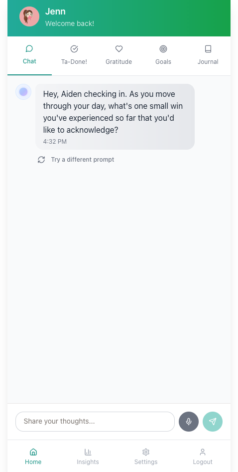
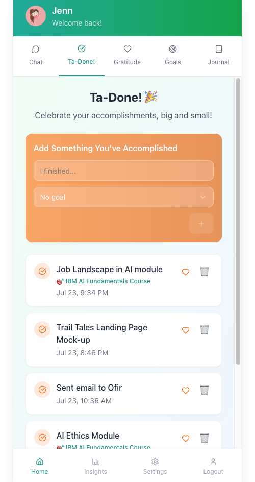
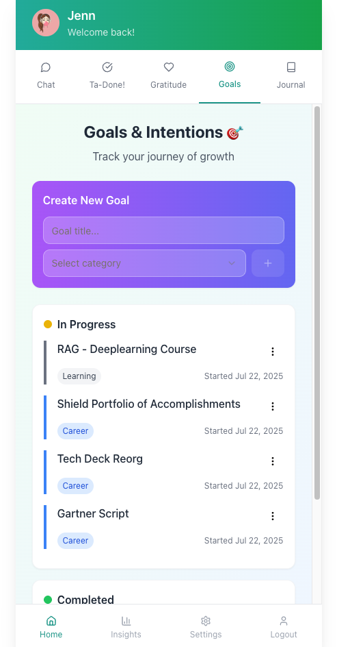

# MindfulFlow

An AI-powered mindful journaling and well-being app. Reflect, celebrate wins, practice gratitude,
and track goals through a conversational companion named Aiden.

<p align="center">
  
  
  
</p>

## Why I built it

I have friends going through hard things and I'm not always available when they need to talk.
This started as a way to give them somewhere to put the thought at 2am, with something on the other
end that responds with actual warmth instead of a mood slider and a streak counter.

That constraint shaped the product. Aiden is written to be a therapist-friend rather than a
cheerleader: supportive by default, but willing to push back, the same way I do for my friends. 
The accomplishment tracker is called "Ta-Done!" because the goal is celebrating what you did, not 
staring at what you haven't. And there is exactly one conversation per day, which keeps it a journal 
instead of a chatbot you fall into.

## Features

- **AI Journal** — Chat with Aiden in a familiar messaging interface. One conversation per day,
  auto-saved in real time. An entry is only created once you send a first message, so you never
  accumulate empty days.
- **Ta-Done! List** — An accomplishment tracker built to celebrate what you've done. Items can link
  to goals.
- **Gratitude Journal** — A simple daily record.
- **Goal Tracker** — Set intentions and track progress over time.
- **Insights & Search** — Ask questions about past entries and surface patterns across them.
- **Voice Input** — Speech-to-text for when typing isn't the thing.
- **Time-Aware Prompts** — Aiden's opening question changes with the time of day in your timezone.
  Mornings set intent; evenings reflect.
- **Custom Profile** — Display name and profile photo.

## Tech Stack

| Layer | Technology |
|---|---|
| Frontend | React + TypeScript (Vite) |
| Styling | Tailwind CSS + shadcn/ui |
| State | TanStack Query |
| Routing | Wouter |
| Backend | Node.js + Express (TypeScript) |
| Database | PostgreSQL via Drizzle ORM |
| AI | OpenAI GPT-4o |
| Auth | Replit Auth (OpenID Connect) |
| Sessions | express-session + connect-pg-simple |

See [`ARCHITECTURE.md`](./ARCHITECTURE.md) for the design decisions behind these, including session
security, the timezone handling, and the admin panel's OpenAI cost tracking.

## The prompts that built it

[`prompts/`](./prompts) holds the original specs I wrote to generate and refine this app:

| File | What it drove |
|---|---|
| [`01-initial-app-spec.txt`](./prompts/01-initial-app-spec.txt) | The full initial build: data model, feature set, and UX intent. |
| [`02-time-aware-prompts.txt`](./prompts/02-time-aware-prompts.txt) | Replacing generic check-ins with time-of-day-aware questions. |
| [`03-conversational-style.txt`](./prompts/03-conversational-style.txt) | Tuning the companion's voice toward supportive-but-challenging. |

These are worth reading alongside the code. The interesting part of building this way isn't the
output, it's how specific the input has to be to get an output worth keeping. The second and third
prompts exist because the first version's check-in questions were generic and its tone was too
agreeable.

Note: the companion was named Arlo during early development and renamed Aiden later. The prompt
files still say Arlo.

## Getting Started

Built on [Replit](https://replit.com). To run locally:

1. Clone the repository.
2. Set these environment variables:
   - `DATABASE_URL` — PostgreSQL connection string
   - `OPENAI_API_KEY` — your OpenAI API key
   - `SESSION_SECRET` — a secret string for session signing
3. Start the dev server:

```bash
npm run dev
```

Available at `http://localhost:5000`.

## Project Structure

```
├── client/            # React frontend
│   └── src/
│       ├── components/
│       ├── pages/
│       └── hooks/
├── server/            # Express backend
│   ├── routes.ts      # API endpoints
│   ├── storage.ts     # Database access layer
│   └── openai.ts      # AI integration
├── shared/
│   └── schema.ts      # Database schema & shared types
├── prompts/           # The specs used to generate the app
└── docs/              # Screenshots
```

## License

MIT
