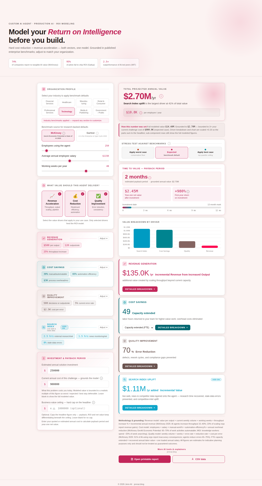

# Combined Solution ROI

**Positioning:** Solution — the Custom AI Agent Model plus an optional live-retrieval ("Search Index") layer, modeling both together without double-counting.

**Tagline:** "Model your *Return on Intelligence* before you build." — same base calculator as [Custom AI Agent Model](custom-ai-agent-model.md), extended with a fourth, optional value driver.

**Live demo:** _not yet linked — see [Access & code availability](../README.md#access--code-availability)_

## What it's for

This calculator is the Custom AI Agent Model with a fourth card added: **Search Index**, an explicitly optional add-on (off by default, one toggle to include it) that models the incremental value of layering live web, news, and competitor data onto the agent. It's built for exactly the case the suite's own positioning describes — a buyer who isn't choosing between an agent and a retrieval layer, but building an agent that depends on grounded, current information underneath it, and wants the return on that combination without the two pieces' value being counted twice.

The "without operational overlap" framing shows up concretely here: the Search Index module has its own hours-based inputs (external research and news-monitoring time) that are separate from the core agent's "manual/automatable work" bucket, so switching it on adds genuinely incremental value rather than re-counting hours the base model already captured.

## Value drivers

The three core drivers are identical to the Custom AI Agent Model: **revenue acceleration** (throughput and output scaling), **cost reduction** (headcount efficiency and automation), and **quality improvement** (error reduction and consistency).

**Search Index uplift**, the optional fourth driver, models three things at once: research and monitoring time recovered (hours per week staff spend on external research and competitive lookups, and on monitoring news/regulatory/market updates, times the percentage the Search Index automates), stale-data errors prevented (the share of consequential errors caused by outdated or missing external data, times the reduction live retrieval delivers), and a competitive-intelligence uplift tied to the share of staff who act on that intelligence weekly. It's presented as a distinct card with an "Add-on" badge throughout the UI — in the input panel, the results breakdown, and the printable report — so it's never ambiguous to a stakeholder whether they're looking at the base agent value or the combined figure.

## Inputs a stakeholder controls

The organization profile and eight-way industry selector (Financial Services, Healthcare, Manufacturing, Retail & Consumer, Professional Services, Technology, Media & Publishing, Government/Public) match the Custom AI Agent Model exactly. The three core value-driver cards expose the same fields as that calculator.

The Search Index card, when switched on, exposes: hours per week per employee on external research and competitive lookups, hours per week monitoring news/regulations/market updates, the percentage of that research and monitoring time the Search Index automates, the percentage of consequential errors caused by outdated or missing external data, the percentage of stale-data errors live retrieval prevents, and the percentage of staff who act on competitive or market intelligence weekly. None of the coefficients behind the defaults for any of the four cards are published — only the fields and their current values.

The same McKinsey/Gartner benchmark toggle and worst/expected/best stress test apply across all four cards at once.

## Grounding the number

The same grounding and ceiling guardrails apply, scoped to whichever drivers are active — if Search Index is off, the headline and its grounding behave exactly like the base Custom AI Agent Model; switching it on adds its value into the same grounded, scaled total rather than as a separate number to reconcile by hand. Entering an estimated solution investment adds the same payback period, year-one net value, first-year ROI, and value-to-cost ratio as the rest of the suite, with the same automatic credibility flags.

## Export

A printable report and CSV export are available directly from the calculator, and both correctly label the Search Index line as an add-on when it's included.
