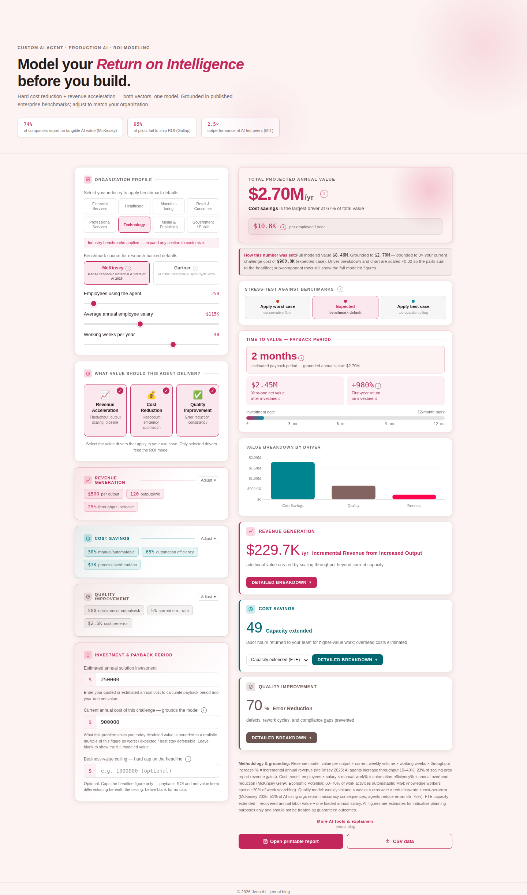

# Custom AI Agent Model

**Positioning:** Solution — models a purpose-built agentic process on its own, independent of industry.

**Tagline:** "Model your *Return on Intelligence* before you build." — "Hard cost reduction + revenue acceleration — both vectors, one model."

**Live demo:** _not yet linked — see [Access & code availability](../README.md#access--code-availability)_

## What it's for

This is the generic version of the agent-value model that each vertical calculator specializes — built for a stakeholder who wants to evaluate an agent build on its own terms, without translating it through one specific industry's workflows, or for a use case that doesn't map cleanly onto one of the five vertical calculators.

The header leads with a different kind of citation than the vertical calculators — not "here's the opportunity size," but "here's why most AI investments don't realize it": McKinsey's finding that 74% of companies report no tangible AI value, Gallup's finding that 95% of pilots fail to ship ROI, and MIT's finding that AI-led peers outperform by 2.5×. That framing sets up the calculator as the tool that keeps a specific deployment from becoming one of those statistics.

## Value drivers

**Revenue acceleration** models throughput, output scaling, and pipeline — the same shape as the vertical calculators' revenue driver, but framed generically as "value per output."

**Cost reduction** models headcount efficiency and automation — labor hours returned by shifting manual, repeatable work to the agent, plus reduction in process overhead.

**Quality improvement** models error reduction and consistency — the value of catching defects, rework, and compliance gaps before they become costly.

## Inputs a stakeholder controls

The organization profile takes employees using the agent, their average annual salary, and working weeks per year. Unlike the fully generic framing the name suggests, this calculator still carries an eight-way industry selector — Financial Services, Healthcare, Manufacturing, Retail & Consumer, Professional Services, Technology, Media & Publishing, and Government/Public — that populates sub-segment-typical defaults. That's what makes it useful as a cross-industry pitch tool: one calculator, any industry preset, rather than five separate builds.

Each value driver exposes its own fields: revenue acceleration exposes value per output, current weekly output volume, and projected throughput increase; cost reduction exposes the manual/automatable-work percentage, automation efficiency, and monthly process overhead; quality improvement exposes weekly decision/output/transaction volume, current error rate, AI-driven error reduction, and average cost to remediate one error. The calibration behind each industry preset isn't published — only the fields and their current values are.

The same McKinsey/Gartner benchmark-source toggle and worst/expected/best stress test apply as across the rest of the suite.

## Grounding the number

The same grounding and ceiling guardrails apply: an optional current-annual-cost-of-challenge field and an optional business-value ceiling, with an inline note whenever either is active explaining exactly what was capped. Entering an estimated solution investment adds payback period, year-one net value, first-year ROI, and a value-to-cost ratio, with the same automatic credibility flags used across the suite — including flagging when ROI is being shown at its display ceiling rather than its raw (and much less credible-looking) value.

## Relationship to the rest of the suite

This calculator is the base this suite is built on. The five vertical calculators are this same logic re-parameterized with industry-specific value-driver categories and citation sources. [Combined Solution ROI](combined-solution-roi.md) is this same calculator with an optional fourth module — a Search Index add-on — layered on top for deployments that pair the agent with live retrieval.

## Export

A printable report and CSV export are available directly from the calculator.
