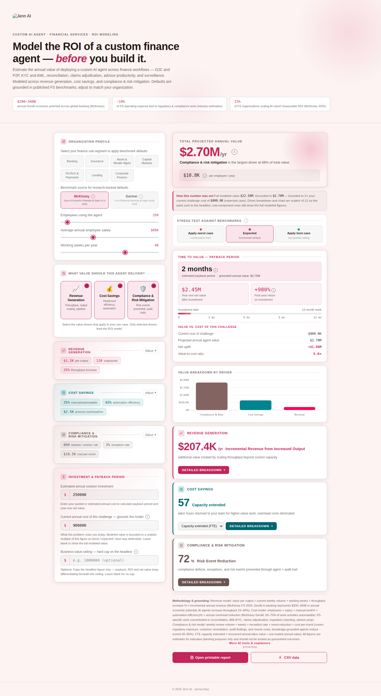

# Financial Services Vertical

**Positioning:** Vertical — models a custom AI agent's ROI in financial-services-specific terms.

**Tagline:** "Model the ROI of a custom finance agent — before you build it."

## What it's for

This calculator estimates the annual value of deploying a custom AI agent across finance workflows: O2C and P2P, KYC and AML, reconciliation, claims adjudication, advisor productivity, and surveillance. It's the calculator to open when the stakeholder in the room is a banking, insurance, or capital-markets buyer who thinks in regulatory exposure and reconciliation backlog, not generic "automation."

Three published benchmarks anchor the header before a stakeholder touches a single input: McKinsey's $200–340B annual GenAI economic potential estimate for global banking, an industry estimate that roughly 10% of FS operating expense ties to regulatory and compliance work, and McKinsey's 2025 finding that 23% of FS organizations scaling AI report measurable ROI. That framing sets expectations before the model even runs.

## Value drivers

A stakeholder can toggle any of three categories independently — only the ones left checked feed the total:

**Revenue generation** models throughput, output scaling, and pipeline effects — the value created by an agent handling more volume at the same headcount.

**Cost savings** models headcount efficiency and automation — labor hours returned by shifting manual, repeatable work to the agent, plus reduction in fixed process overhead.

**Compliance & risk mitigation** models risk events prevented and audit-trail completeness — the value of catching exceptions (AML/KYC flags, trade breaks, claims rework) before they become costly remediation.

## Inputs a stakeholder controls

The organization profile sets the baseline: employees using the agent, their average annual salary, and working weeks per year — this triple converts to an hourly rate every downstream dollar figure rides on. A one-click industry selector (Banking, Insurance, Asset & Wealth Management, Capital Markets, FinTech & Payments, Lending, Corporate Finance) populates every field below with sub-segment-typical defaults, fully overridable.

Each value-driver category exposes three to four editable fields — for example, revenue generation exposes value per output, current weekly output volume, and expected throughput lift percentage. None of the underlying coefficients behind the industry presets are published; what's editable is the field, not the calibration behind its default.

A benchmark-source toggle (McKinsey vs. Gartner) swaps every default and its citation strip at once, and a worst/expected/best stress-test switch re-populates the same fields with that source's conservative, expected, or top-quartile scenario — letting a stakeholder see the defensible range in three clicks.

## Grounding the number

Two optional fields keep the model honest: "current annual cost of this challenge" bounds the projected value to a realistic multiple of what the problem costs today, and an optional "business-value ceiling" hard-caps the headline outright. When either is active, an inline note explains exactly what was capped — the full modeled figure is never hidden, only labeled. Once a stakeholder enters an estimated solution investment, the calculator adds payback period, year-one net value, first-year ROI, and a value-to-cost ratio, with automatic flags if the modeled value looks disproportionate to the stated problem cost or if ROI is being shown at its display ceiling.

## Export

A printable one-page report and a CSV of the underlying numbers are both available directly from the calculator — a stakeholder can leave the room with a defensible summary without ever seeing the source file.
