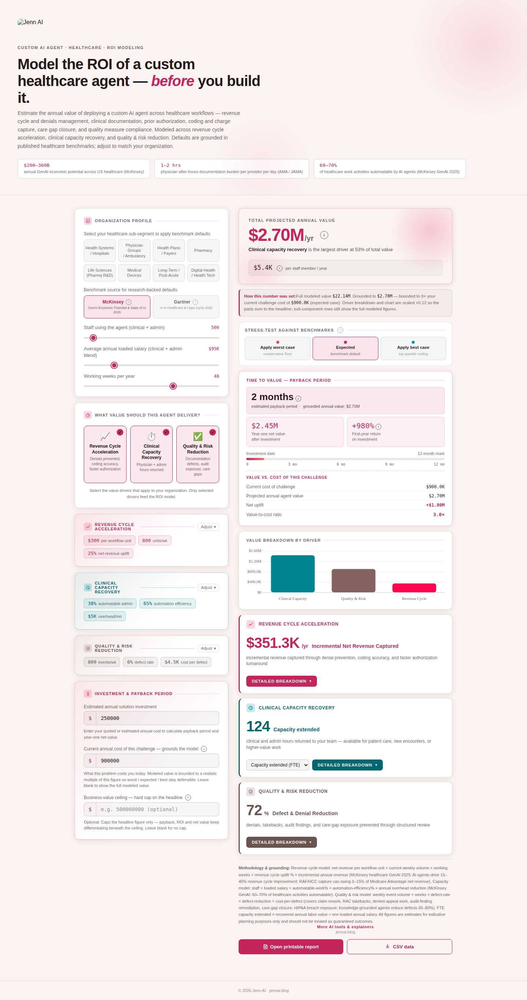

# Healthcare Vertical

**Positioning:** Vertical — models a custom AI agent's ROI in healthcare-specific terms.

**Tagline:** "Model the ROI of a custom healthcare agent — before you build it."

## What it's for

This calculator estimates the annual value of deploying a custom AI agent across healthcare workflows: revenue cycle and denials management, clinical documentation, prior authorization, coding and charge capture, care gap closure, and quality measure compliance. It's built for a stakeholder who thinks in claims, denials, and physician burden rather than generic "efficiency."

The header anchors the conversation with three cited figures: McKinsey's $200–360B annual GenAI economic potential estimate for US healthcare, the AMA/JAMA-sourced 1–2 hours of physician after-hours documentation burden per provider per day, and McKinsey's 2025 estimate that 60–70% of healthcare work activities are automatable by AI agents.

## Value drivers

**Revenue cycle acceleration** models denials prevented, coding accuracy, and faster authorization turnaround — the direct revenue impact of getting claims right and paid faster the first time.

**Clinical capacity recovery** models physician and administrative hours returned — time an agent frees up for patient care or higher-value work, expressed later as a capacity figure (FTEs, hours, workdays, or person-weeks).

**Quality & risk reduction** models documentation defects, audit exposure, and care-gap closure — the value of catching compliance and quality issues before they become RAC takebacks, denied appeals, or HIPAA exposure.

## Inputs a stakeholder controls

The organization profile takes staff using the agent (clinical plus admin, blended), an average annual loaded salary for that blend, and working weeks per year. An eight-way industry selector — Health Systems/Hospitals, Physician Groups/Ambulatory, Health Plans/Payers, Pharmacy, Life Sciences (Pharma R&D), Medical Devices, Long-Term/Post-Acute, and Digital Health/Health Tech — one-click-populates sub-segment-typical defaults across every field, all of which stay editable.

Each value-driver category exposes its own set of fields: revenue cycle acceleration exposes value per workflow unit, weekly unit volume, and expected net revenue uplift; clinical capacity recovery exposes the automatable-admin percentage, automation efficiency, and monthly overhead; quality & risk reduction exposes weekly event volume, defect rate, and cost per defect. As with the other verticals, the calibration behind each sub-segment's defaults isn't published — only the editable fields and their current values are visible.

The same McKinsey/Gartner benchmark-source toggle and worst/expected/best stress test apply here, each source citing its own healthcare-specific research (GenAI Economic Potential & State of AI 2025 for McKinsey; AI in Healthcare & Hype Cycle 2025 for Gartner).

## Grounding the number

The same guardrails apply as across the suite: an optional current-cost-of-challenge field bounds the model to a defensible multiple of today's cost, an optional value ceiling caps the headline outright, and both are labeled inline when active rather than silently hidden. Entering an estimated solution investment adds payback period, year-one net value, first-year ROI, and a value-to-cost ratio, with automatic credibility flags if a result looks disproportionate.

## Export

A printable report and CSV export let a stakeholder take the numbers with them without any access to the calculator's source.
