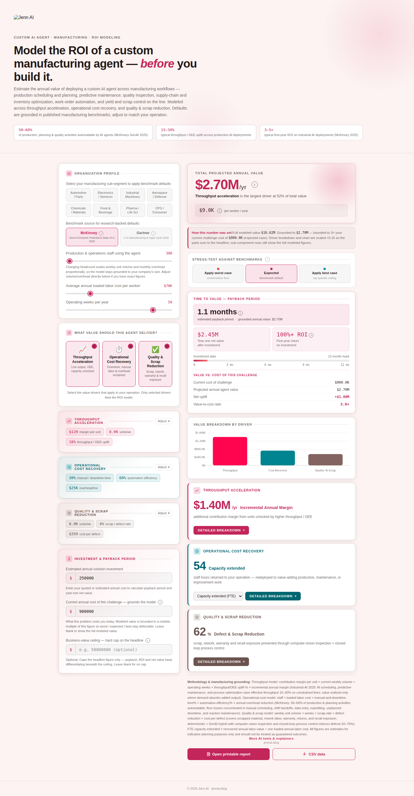

# Manufacturing Vertical

**Positioning:** Vertical — models a custom AI agent's ROI in manufacturing-specific terms.

**Tagline:** "Model the ROI of a custom manufacturing agent — before you build it."

**Live demo:** _not yet linked — see [Access & code availability](../README.md#access--code-availability)_

## What it's for

This calculator estimates the annual value of deploying a custom AI agent across manufacturing workflows: production scheduling and planning, predictive maintenance, quality inspection, supply-chain and inventory optimization, work-order automation, and yield and scrap control on the line. It speaks in throughput, OEE, and scrap rate — the language of a plant operations or industrial engineering stakeholder.

The header cites three benchmarks: McKinsey's 2025 estimate that 50–60% of production, planning, and quality activities are automatable by AI agents; a typical 15–30% throughput/OEE uplift observed across production AI deployments; and a typical 3–5× first-year ROI on industrial AI deployments per McKinsey 2025.

## Value drivers

**Throughput acceleration** models line output, OEE, and unlocked capacity — the contribution-margin value of units a plant can now produce that it couldn't before.

**Operational cost recovery** models downtime and manual labor/overhead reclaimed — hours returned to the operation and redeployed to higher-value production, maintenance, or improvement work.

**Quality & scrap reduction** models scrap, rework, and warranty/recall exposure — the value of catching defects before they become scrapped material or a field recall.

## Inputs a stakeholder controls

The organization profile takes production and operations staff using the agent, average annual loaded labor cost per worker, and operating weeks per year. Unlike the other verticals, this calculator flags explicitly that changing headcount scales weekly unit volume and monthly overhead proportionally — a stakeholder can override volume and overhead directly if they have exact figures rather than relying on that proportional scaling.

An eight-way industry selector (Automotive/Parts, Electronics/Semicon, Industrial Machinery, Aerospace/Defense, Chemicals/Materials, Food & Beverage, Pharma/Life Sciences, CPG/Consumer) sets sub-segment-typical defaults across every field. Each value-driver category exposes its own inputs: throughput acceleration exposes margin per unit, weekly unit volume, and throughput/OEE uplift percentage; operational cost recovery exposes manual/downtime-time percentage, automation efficiency, and monthly overhead; quality & scrap reduction exposes weekly unit volume, scrap/defect rate, and cost per defect. The sub-segment calibration behind each preset isn't published — only the fields and their current values are.

The same McKinsey/Gartner toggle and worst/expected/best stress test apply, each citing manufacturing-specific research (Industrial AI 2025 for McKinsey; AI in Manufacturing & Hype Cycle 2025 for Gartner).

## Grounding the number

The same grounding and ceiling guardrails apply: an optional current-cost-of-challenge field, an optional value ceiling, and an inline note whenever either is active. Entering an estimated solution investment adds payback period, year-one net value, first-year ROI, and a value-to-cost ratio, with automatic flags when a result looks disproportionate to the stated challenge cost.

## Export

A printable report and CSV export are available directly from the calculator.
