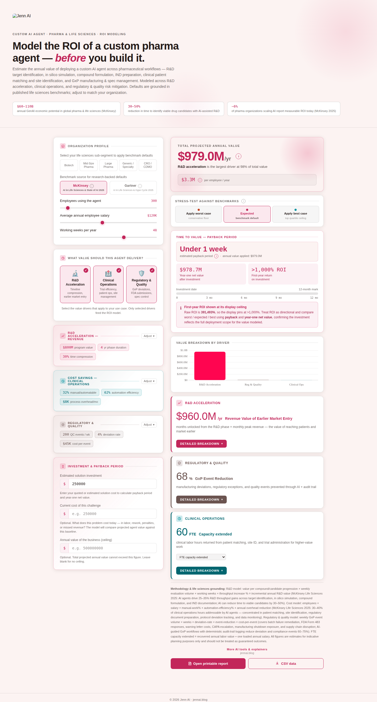

# Pharma Vertical

**Positioning:** Vertical — models a custom AI agent's ROI in pharmaceutical and life-sciences-specific terms.

**Tagline:** "Model the ROI of a custom pharma agent — before you build it."

## What it's for

This calculator estimates the annual value of deploying a custom AI agent across pharmaceutical workflows: R&D target identification, in silico simulation, compound formulation, IND preparation, clinical patient matching and site identification, and GxP manufacturing and spec management. It's built for a stakeholder who thinks in trial timelines, regulatory submissions, and manufacturing deviations — not generic productivity.

The header cites three benchmarks: McKinsey's $60–110B annual GenAI economic potential estimate for global pharma and life sciences, a 30–50% reduction in time to identify viable drug candidates with AI-assisted R&D, and McKinsey's 2025 finding that only about 6% of pharma organizations scaling AI report measurable ROI today — a useful reality check for a stakeholder weighing how far ahead this would put them.

## Value drivers

**R&D acceleration** models timeline compression and earlier market entry — the revenue value of reaching patients (and revenue) sooner, driven by months unlocked from a given R&D phase.

**Clinical operations** models trial efficiency, patient ops, and site management — labor hours returned from patient matching, site identification, and trial administration.

**Regulatory & quality** models GxP deviations, FDA submissions, and spec control — the value of preventing manufacturing deviations and regulatory exceptions before they trigger a Form 483, warning letter, or CAPA escalation.

## Inputs a stakeholder controls

The organization profile takes employees using the agent, their average annual salary, and working weeks per year. A five-way industry selector (Biotech, Mid-Size Pharma, Large Pharma, Generic/Specialty, CRO/CDMO) sets sub-segment-typical defaults across every field.

Each value driver exposes its own inputs: R&D acceleration exposes program value, phase duration in years, and expected timeline-compression percentage — reflecting that pharma value is dominated by how much earlier a program reaches market, not headcount efficiency alone. Clinical operations exposes the automatable-work percentage, automation efficiency, and monthly process overhead. Regulatory & quality exposes weekly QC event volume, deviation rate, and cost per event. The calibration behind each sub-segment's defaults isn't published — only the editable fields and their current values are.

The same McKinsey/Gartner benchmark toggle and worst/expected/best stress test apply, each citing life-sciences-specific research.

## Grounding the number

Because R&D program value can run into the hundreds of millions, this calculator's grounding and ceiling fields matter more than most: an optional current-cost-of-challenge field and an optional annual value ceiling keep the headline defensible even when the underlying program value is large, with an inline note explaining what was capped whenever either guardrail is active. Entering an estimated solution investment adds payback period, year-one net value, and first-year ROI, with the same automatic credibility flag if ROI is being shown at its display ceiling.

## Export

A printable report and CSV export are available directly from the calculator.
