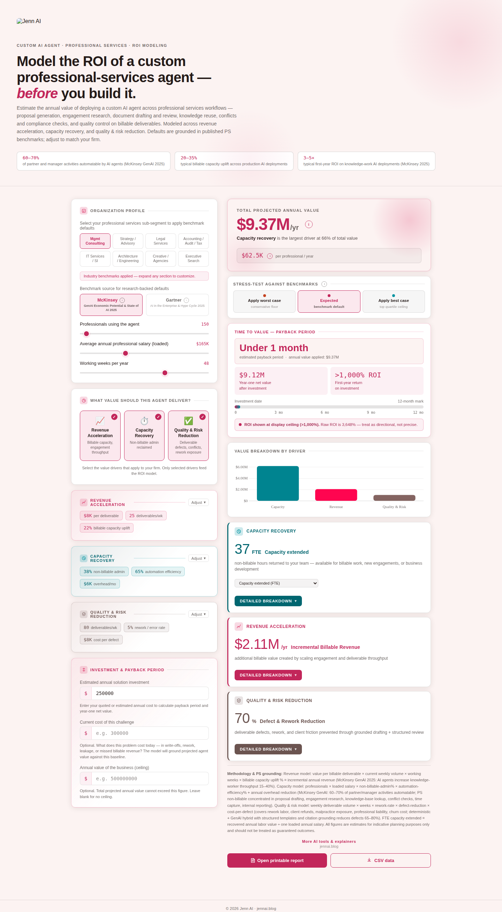

# Professional Services Vertical

**Positioning:** Vertical — models a custom AI agent's ROI in professional-services-specific terms.

**Tagline:** "Model the ROI of a custom professional-services agent — before you build it."

**Live demo:** _not yet linked — see [Access & code availability](../README.md#access--code-availability)_

## What it's for

This calculator estimates the annual value of deploying a custom AI agent across professional-services workflows: proposal generation, engagement research, document drafting and review, knowledge reuse, conflicts and compliance checks, and quality control on billable deliverables. It's the calculator for a partner, principal, or ops lead at a consulting, legal, or advisory firm who thinks in billable capacity and deliverable rework, not generic headcount efficiency.

The header cites three benchmarks: McKinsey's 2025 estimate that 60–70% of partner and manager activities are automatable by AI agents, a typical 20–35% billable-capacity uplift across production AI deployments, and a typical 3–5× first-year ROI on knowledge-work AI deployments (McKinsey 2025).

## Value drivers

**Revenue acceleration** models billable capacity and engagement throughput — the value of an agent letting the firm take on more billable work at the same headcount.

**Capacity recovery** models non-billable admin work reclaimed — hours returned from proposal drafting, research, and internal reporting that don't bill a client directly.

**Quality & risk reduction** models deliverable defects, conflicts, and rework exposure — the value of catching errors, conflicts, or compliance issues before they become client-facing rework or liability exposure.

## Inputs a stakeholder controls

The organization profile takes professionals using the agent, their average annual loaded salary, and working weeks per year. An eight-way industry selector — Management Consulting, Strategy/Advisory, Legal Services, Accounting/Audit/Tax, IT Services/SI, Architecture/Engineering, Creative/Agencies, and Executive Search — one-click-populates sub-segment-typical defaults, fully overridable.

Each value driver exposes its own fields: revenue acceleration exposes value per billable deliverable, current weekly deliverable volume, and projected billable-capacity uplift; capacity recovery exposes the percentage of professional time on non-billable admin work, automation efficiency, and monthly overhead (research databases, drafting tools, rework costs); quality & risk reduction exposes weekly deliverable/opinion/decision volume, current rework or defect rate, the reduction the agent delivers, and average cost per deliverable defect. As across the suite, the calibration behind each sub-segment's defaults isn't published — only the fields and their current values are.

The same McKinsey/Gartner benchmark-source toggle and worst/expected/best stress test apply, each citing PS-specific research.

## Grounding the number

The same guardrails apply: an optional current-cost-of-challenge field (framed here as write-offs, rework, leakage, or missed billable revenue) bounds the model to a defensible multiple of today's cost, an optional value ceiling caps the headline outright, and an inline note explains exactly what was capped whenever either is active. Entering an estimated solution investment adds payback period, year-one net value, first-year ROI, and a value-to-cost ratio, with the same automatic credibility flags used across the suite.

## Export

A printable report and CSV export are available directly from the calculator.
